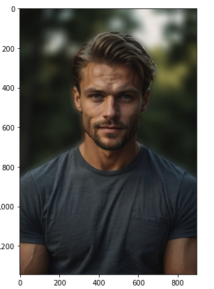

## 🔑 **PRT(Peer Review Template)**

- [ ]  **1. 주어진 문제를 해결하는 완성된 코드가 제출되었나요? (완성도)**
    - 문제에서 요구하는 최종 결과물이 첨부되었는지 확인
    - [x] 인물 모드 사진 구현
        
    - [ ] 인물 모드 문제점 사진
    - [x] 인물모드 사진의 문제점을 개선할 수 있는 솔루션 제시
        

- [x]  **2. 프로젝트에서 핵심적인 부분에 대한 설명이 주석(닥스트링) 및 마크다운 형태로 잘 기록되어있나요? (설명)**
    - [x] 기능을 함수로 적절히 분할하여 구현했고 가독성이 좋은 간결한 주석을 기록하였습니다.
        

- [ ]  **3. 체크리스트에 해당하는 항목들을 모두 수행하였나요? (문제 해결)**
    - [ ]  데이터를 분할하여 프로젝트를 진행했나요? (train, validation, test 데이터로 구분)
    - [ ]  하이퍼파라미터를 변경해가며 여러 시도를 했나요? (learning rate, dropout rate, unit, batch size, epoch 등)
    - [x]  각 실험을 시각화하여 비교하였나요?
        
    - [ ]  모든 실험 결과가 기록되었나요?

- [ ]  **4. 프로젝트에 대한 회고가 상세히 기록 되어 있나요? (회고, 정리)**
    - [ ]  배운 점
    - [ ]  아쉬운 점
    - [ ]  느낀 점
    - [ ]  어려웠던 점

---

# 회고
> conv관련 배운점 요약

## 느낀점 / 아쉬운점

- Depthwise separable convolution에서 헷갈리는 부분들을 정리하다보니, 실험에 크게 힘을 쏟지는 못했던 것 같다.
- Atrous Convolution의 rate로 띄워지는 공간이 채워지는 줄 알았는데, 알고보니 그냥 크기만 키우는 방식이었다.
- depth prediction에 대해서 좀 더 깊게 파보고 싶다는 생각을 했다.

## 배운점
> https://minkj1992.github.io/conv/

#### Standard Conv Layer

일반적인 `Conv layer`는 (3,3) 또는 (5,5) `kernel`을 사용하여 슬라이딩하며 `feature map`을 생성합니다. 예를 들어, 입력이 128*128 크기의 컬러 이미지라면 (128, 128, 3)의 형태를 가집니다. RGB 채널 각각에 대해 3개의 weight(kernel)를 사용하여 슬라이딩을 시행하고, stride=1인 경우 (128 - 3 + 1, 128 - 3 + 1, 3) 크기의 output matrix들이 생성됩니다.

이 output matrix들은 Relu activation에 넣기 위해, 3개의 output matrix (126, 126, 3)를 채널 방향으로 모두 합친 후, (126, 126) 크기의 bias matrix를 더한 값을 Relu에 넣어줍니다. 

이를 수식으로 나타내면 다음과 같습니다:

$$
\text{Relu}((\text{Conv}(I, W) + B))
$$

여기서 \( I \)는 입력 이미지, \( W \)는 커널, \( B \)는 bias입니다. 이를 수식으로 정리하면,

$$
\text{Relu}(\sum_{c=1}^3 \text{Conv}(I_c, W_c) + B)
$$

여기서 \( I_c \)는 각 채널에 대한 입력, \( W_c \)는 각 채널에 대한 커널입니다. 
따라서 최종 수식은 다음과 같습니다:

$$
\text{Relu} \left( \left( \sum_{c=1}^{3} \text{Conv}(I_c, W_c) \right) + B \right)
$$

#### Point-wise Convolution
> Convolution Layer with a 1x1 kernels

- [Andrew Ng's lecture](https://www.youtube.com/watch?v=c1RBQzKsDCk)

Point-wise conv는 커널 크기가 1x1로 고정된 convolution Layer를 말한다. 이때 point wise conv가 1x1이더라도, kernel의 차원 수는 input channel을 따른다는 것이다. (매우 헷갈렸던 것 중에 하나가, 1x1x1인지 아닌지 였고, 결론은 `1 x 1 x inputchannel`이다.)

Standard conv layer도 생각해보면 input channel들을 모두 더하고 bias 더한다음 `activation()`을 실행하기 때문에, standard conv layer와의 차이점은 `1x1` 사이즈 말고는 없다. 다른 블로그 글읽어보면 Dimensionality Reduction이니 뭐니 1x1의 특성처럼 말하던데, standard conv도 이미 동일하게 input channel들 합쳐주고 있으니 point wise만의 특별한 feature는 아니다.

- Input의 채널들을 하나로 합쳤다고 볼 수 있다. (Standard Conv layer와 동일)
- 1x1로 sliding하기 때문에 Spatial Feature들은 추출하지 못한다. (Standard Conv의 kernel_size=3 라면 3x3 영역에서 픽셀간의 상관관계를 얻을 수 있음)

(28,28,192)에 대해서 1x1 conv(weight가 192개인 1x1x192)를 통과시키면, (28 x 28) 크기의 feature map이 만들어진다. 이때 filter 갯수가 32개라고 한다면, 이를 32번 반복하여, (28,28,32)의 feature map을 만들어낼 수 있다.

<u>사실 standard conv와 다를건 없지만, standard conv와 달리 height와 width가 보존 되면서 채널만 축소되는 효과를 가질 수 있기 때문에, 차원 축소를 원할 때 1x1를 자주 사용하는 것 같다.</u>

- [ResNet BottleNeck 원리](https://coding-yoon.tistory.com/116)

#### Depth-wise Convolution
> Channel-independent Convolution

- input channel들을 독립적으로 처리한다. -> 각 채널들의 spatial Feature를 추출 할 수 있다.
- Depth-wise convolution은 각 단일 input channel에 대해서만 수행되는 필터를 사용합니다. 
- 즉 이 때문에 필연적으로, `입력 채널 수 = 필터수`가 됩니다. (=입력-출력 채널의 수가 동일하다.)

#### Depthwise separable convolution
> 'Separate Spatial feature'(depth-wise) and 'Cross channel'(point-wise) Correlation

- `Original Convolution`
    - 전체 채널에 대한 Spatial Convolution
- `Depth-wise Separable Convolution`
    - 각 채널 별 Spatial Convolution 이후(depth-wise) -> Feature별 Linear Combination (point-wise)

#### refs

- [Designing more efficient conv nn](https://www.slideshare.net/slideshow/designing-more-efficient-convolution-neural-network-122869307/122869307)

#### 축소하고 복원 방식으로 학습하는 이유? (Auto Encoder)
> https://techblog-history-younghunjo1.tistory.com/130#google_vignette

> 오토인코더는 입력 데이터와 재구성된 데이터 사이의 차이를 최소화하는 방식으로 학습됩니다. 이는 오토인코더가 데이터의 가장 중요한 특징을 포착하는 압축된 표현을 학습하려고 하기 때문입니다. 오토인코더가 이 압축된 표현에서 입력 데이터를 재구성하도록 강제함으로써 모델은 데이터의 기본 구조를 학습하도록 강제됩니다. 이는 차원 감소 및 노이즈 제거와 같은 작업에 유용할 수 있습니다.

차원을 축소하고 다시 복원하는 방식으로 학습하는 Auto encoder는 Encoder-Decoder 패턴으로 데이터를 압축한 다음 복원하면서 학습을 합니다.

그냥 데이터를 압축하지 않고, 출력 데이터를 그대로 내보낸다음 label값과 loss계산하면 되는데 굳이 왜 압축/복원 과정이 필요한가? 라는 질문에는 

**우리가 원하는 것은 입력 데이터를 압축시킴으로써 얻는 내재된(latent) 정보를 얻는 것이기 때문입니다.** 또한 압축을 통해 양이 큰 데이터를 축소시켜 전달할 수 있으며 압축된 이후 복원하면서, important feature만 남아 중요한 피처들이 더 잘 살아있기도 합니다.

또한 입력 데이터 vs 입력->압축->복원 값을 비교함으로써 label없이도 평가할 수 있는 unsupervised learning입니다.

데이터의 가장 중요한 특징을 포착하는 압축된 표현을 학습

#### Atrous Convolution 
> Atrous Conv의 Q. 빈공간은 뭐로 채워지는 건가? 안채워도 된다.

- Contextual Information을 더 잘 반영하기 위해서는 Receptive Field를 확장할 필요가 있다.
- [Atrous convolution(dilated convolution)](https://better-tomorrow.tistory.com/entry/Atrous-Convolution)

